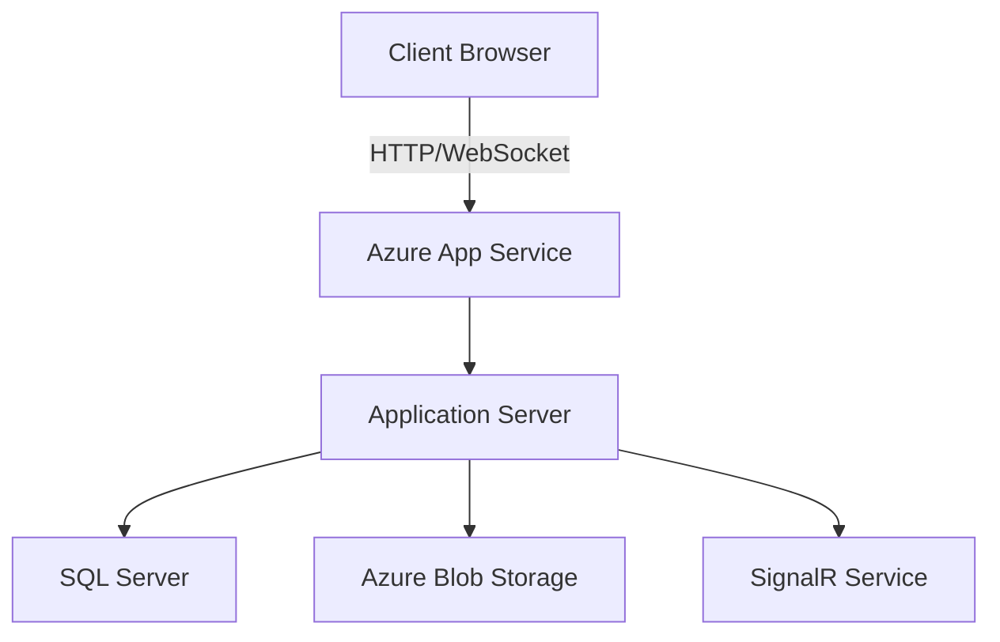

# System Architecture

## Overview
The system follows a layered architecture pattern with clear separation of concerns.

## Architecture Layers
```
📦 Coderboard.Web
├── 🔷 Presentation Layer (Razor Pages)
│   ├── Pages
│   ├── Components
│   └── wwwroot
├── 🔷 Application Layer
│   ├── Services
│   ├── Interfaces
│   └── DTOs
├── 🔷 Domain Layer
│   ├── Entities
│   ├── Interfaces
│   └── ValueObjects
└── 🔷 Infrastructure Layer
    ├── Data
    ├── Authentication
    └── External Services
```

## Key Components

### Presentation Layer
- Razor Pages for server-side rendering
- JavaScript modules for interactive features
- SignalR for real-time communication
- Component-based UI architecture

### Application Layer
- Business logic implementation
- Service interfaces
- DTO mappings
- Validation rules

### Domain Layer
- Core business entities
- Domain logic
- Business rules
- Value objects

### Infrastructure Layer
- Database context and repositories
- Authentication providers
- External service integrations
- Caching implementation

## Cross-Cutting Concerns
- Logging
- Error handling
- Authentication/Authorization
- Caching
- Real-time communication

## Technology Stack Details
1. **Frontend**
   - ASP.NET Core Razor Pages
   - JavaScript/TypeScript
   - SignalR
   - CSS Modules

2. **Backend**
   - ASP.NET Core 8.0
   - Entity Framework Core
   - SQL Server
   - Azure Services

3. **Authentication**
   - JWT Token-based
   - ASP.NET Core Identity
   - Role-based authorization

4. **Real-time Features**
   - SignalR Hubs
   - WebSocket communication
   - Client-side state management

## Deployment Architecture


## Security Considerations
- JWT token management
- HTTPS enforcement
- XSS prevention
- CSRF protection
- Input validation
- Data encryption

## Performance Optimization
- Caching strategy
- Resource optimization
- Database indexing
- Lazy loading
- Connection pooling 